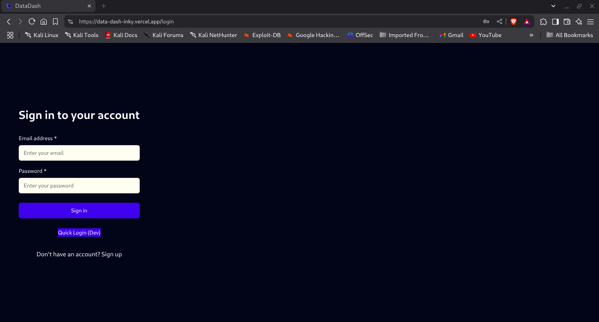
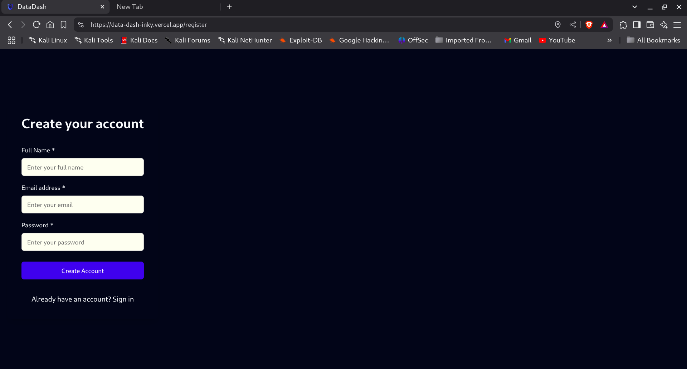
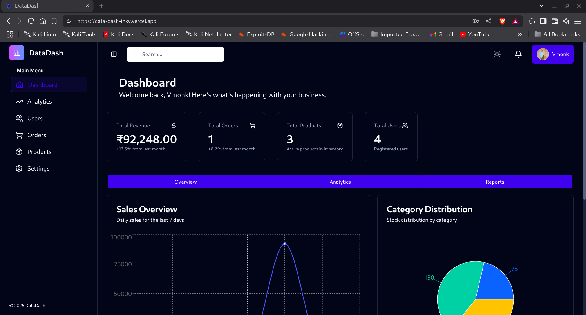
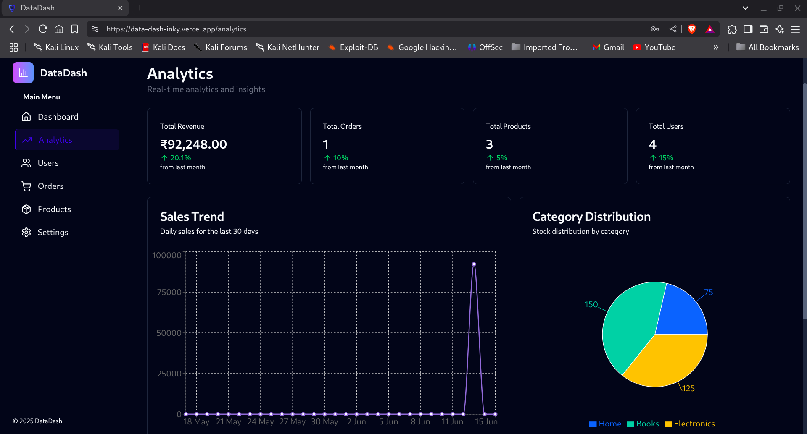
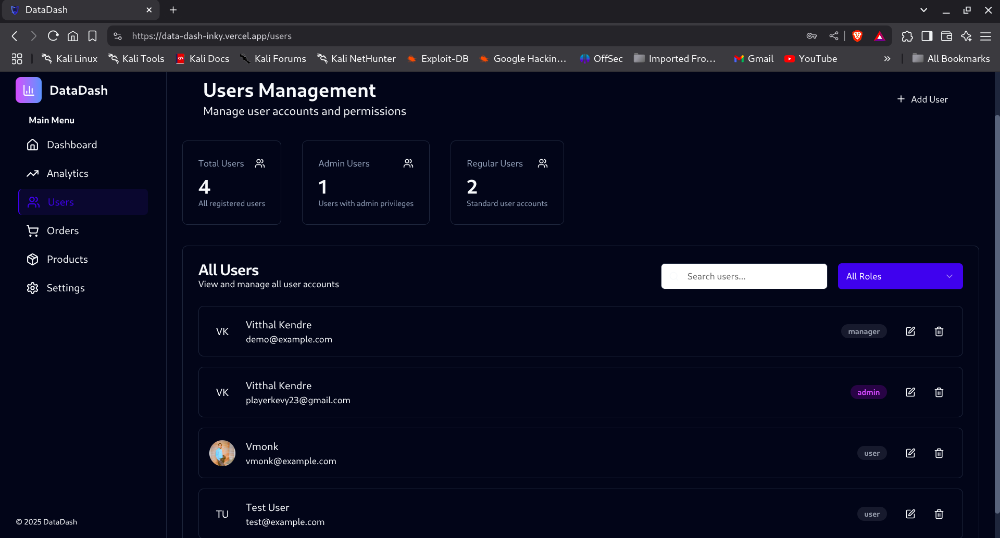
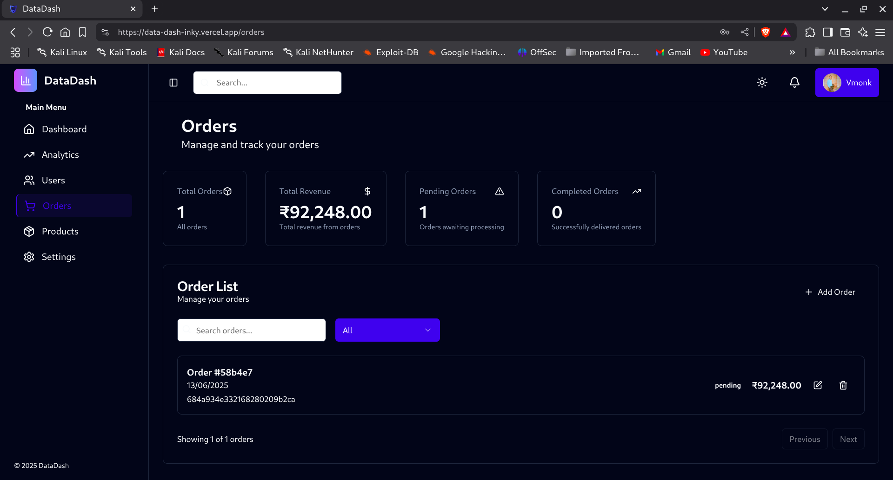
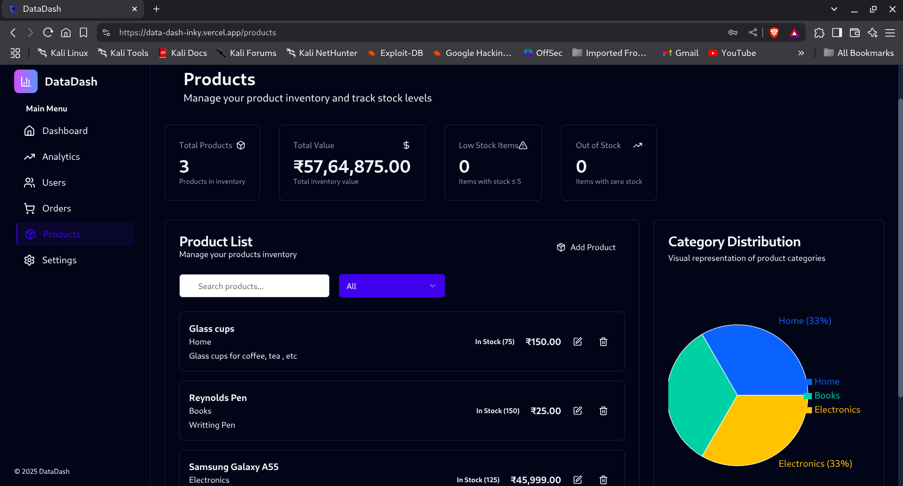
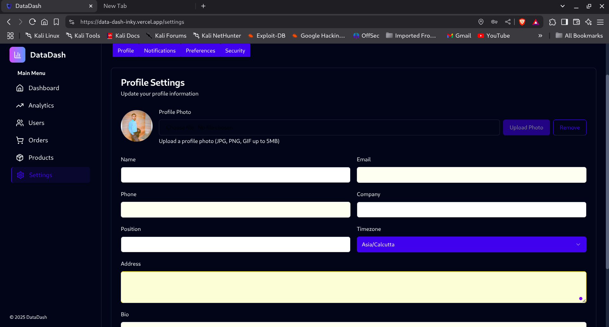

# 📊 DataDash

**DataDash** is a modern, full-stack web application designed for effortless **data visualization** and **management**. Built using the **MERN** stack and **TypeScript**, it combines a responsive user interface with secure backend services to deliver real-time insights and intuitive controls.

---

## 📸 Screenshots

| Login | Register | Dashboard |
|-------|----------|-----------|
|  |  |  |

| Analytics | Users | Orders |
|-----------|-------|--------|
|  |  |  |

| Products | Settings |
|----------|----------|
|  |  |

> 💡 Make sure the images are placed in `assets/screenshots/` directory. Update the path if you use a different folder.

---

## 🚀 Key Features

- 📈 **Interactive Dashboards** – Visualize and monitor metrics in real-time
- 🔐 **Authentication** – JWT-based secure login & registration
- ⚙️ **User Roles** – Admin/user roles with access control
- 📄 **Data Management** – CRUD operations with MongoDB
- 🖥️ **Responsive Design** – Works across devices
- 🌐 **RESTful API** – Scalable and well-structured endpoints

---

## 🧱 Project Structure

```
.
├── client/          # React frontend (Vite, Tailwind) — port 5173
└── server/          # Node.js + Express backend — port 4001
```

---

## 🛠️ Technologies Used

### Frontend
- React + TypeScript
- Tailwind CSS
- React Router DOM
- React Query

### Backend
- Node.js + Express
- TypeScript
- MongoDB + Mongoose
- JWT Authentication
- bcrypt for password hashing

---

## ⚙️ Installation & Setup

### 🔧 Backend Setup

```bash
cd server
npm install
```

Create a `.env` file in the `server` directory:

```env
PORT=4001
MONGODB_URI=mongodb://localhost:27017/data-dash
JWT_SECRET=your-super-secret-key
NODE_ENV=development
```

Start the backend server:

```bash
npm run dev
```

> The backend will be running at: `http://localhost:4001`

---

### 🌐 Frontend Setup

```bash
cd client
npm install
npm run dev
```

> The frontend will be running at: `http://localhost:5173`

---

## 🔌 API Endpoints

### User Routes

- `POST /api/users/register` – Register a new user  
- `POST /api/users/login` – Login with credentials  
- `GET /api/users/me` – Retrieve current user profile  
- `GET /api/users` – Get all users (admin only)

> ✅ Additional endpoints can be added for extended functionality.

---

## 🌍 Deployment

### Frontend
- Deploy to [Vercel](https://vercel.com)

### Backend
- Deploy using [Render](https://render.com)

  ### Database
  - Integrated using [mongoDB](https://cloud.mongodb.com)

Ensure you configure production environment variables in your deployment platform.

---
